Title: Learning dPASP through examples

# Learning <abbr style="font-variant: normal;">dPASP</abbr> through examples

<!--!!! abs "Abstract"-->

In this tutorial, we shall cover the key features of dPASP by walking through a few practical
examples. This guide is not concerned with the theory behind dPASP, but instead in providing a
hands-on tutorial on programming with the dPASP language.

## Table of Contents

[TOC]

### The <abbr style="font-variant: normal;">dPASP</abbr> Framework

dPASP stands for *differential Probabilistic Answer Set Programming*. Let us break down that long title to better graps for what the framework is intended. Answer Set Programming (ASP) is a relatively recent type of declarative programming language for describing and solving combinatorial problems (e.g., indendepent sets, 3-coloring, scheduling, etc). It is reminiscient of logic programming (Prolog) languages and constraint solving. Typically, an ASP program will describe a set of choices that constitute candidate solutions (paths or colorings in a graph, job schedulings) and a set of constraints that determine feasibility. Solutions are obtained as feasible choices, Addtionally, preferences and weights can be assigned to solutions, and maximized over.
Probabilistic ASP extends such a language with the ability to model uncertainty over solutions. 
By assigning a full probabilistic model over ASP programs, one enables parametric learning from data and program induction.
Our last ingredient is the differential modifier. This stands for the ability of probabilistic choices to be specified as the output of differentiable models (e.g., neural networks), which grants a differentiable semantics of such programs.
That means that we can learn, in an end-to-end fashion, the paremeters of deep machine learing models whose output assign truth-values to propositions that are further constrained by logic rules in ASP. 

The rest of this turorial will introduce the reader to all of those components, including the syntax, semantics, inference and learning of dPASP programs. By the end of this tutorial, the reader shall have a clearer understanding on how to...

1. ...describe certain knowledge through the language of dPASP;
2. ...describe probabilistic knowledge;
3. ...embed neural networks in dPASP;
4. ...query for joints and conditionals;
5. ...learn the parameters of dPASP programs from data.

This tutorial is best followed by a hands-on approach, where examples are implemented and tested. 
This requires having access to a working version of the dPASP system. 
The next section describe how to install the system on your computer in detail. 
If you already have access to the system, you may [skip it](#uncertain-knowledge-as-programs).

### Installation

There are three different ways to install dPASP: (1) as an [AUR package](#aur-package), (2) as a
[PyPI project](#pypi) or (3) from [source](#from-source). The dPASP framework is only available for
Linux.

#### AUR Package

The `python-pasp` package is available for Arch Linux based distros (replace `yay` with your AUR
helper or manually install with `makepkg`). Simply run

```bash
yay -S python-pasp
```

and you're good to go.

#### PyPI

To install from the PyPI repository via `pip`, first install
[clingo](https://potassco.org/clingo/)'s C API; e.g. on Debian or Ubuntu

```bash
sudo add-apt-repository ppa:potassco/stable
sudo apt update
sudo apt install clingo libclingo-dev
```

and then simply run

```bash
pip install pasp-plp
```

#### From Source

dPASP only has three build dependencies: (1) [clingo](https://potassco.org/clingo/)'s C API (see
previous section for details on how to install it on Debian/Ubuntu), (2)
[setuptools](https://setuptools.pypa.io/en/latest/userguide/quickstart.html), and (3)
[NumPy](https://numpy.org/). They should be installed *before* compiling and installing dPASP.

Runtime dependencies for dPASP: (1) [clingo](https://potassco.org/clingo/), (2)
[lark](https://lark-parser.readthedocs.io/en/latest/), (3) [NumPy](https://numpy.org/), (4)
[pandas](https://pandas.pydata.org/) and optionally (5) [PyTorch](https://pytorch.org/) for neural
extensions.

To install from source, download the dPASP [repository](https://github.com/kamel-usp/dpasp),
compile and install.

```bash
# Download the dPASP repository.
git clone https://github.com/kamel-usp/dpasp
# Initialize submodules. Might ask for SSH password.
git submodule update --init --recursive
# Compile.
python setup.py build
# Install.
python setup.py install
```

#### Usage

Once installed, you may either use dPASP from the command-line

```
% For more information and semantics options, see
pasp --help
```

by passing a program as a file

```
pasp path/to/my/program.plp
```

or by typing in the program directly through the standard input:

```
pasp
% This is my program.
...
```

Alternatively, you may use the Python API to have a more fine-grained control over the program. The
`parse` function accepts either a path to a file or a program as a string if the `from_str` keyword
argument is set to `True`.

```python
import pasp
P = pasp.parse("path/to/my/program.plp")
P()
```

See the [documentation](https://kamel.ime.usp.br/dpasp/pasp.html) for more information on the
Python API.

### (Un)certain Knowledge as Programs

dPASP is a declarative programming language built around the idea of describing certain knowledge
in the form of logical rules and uncertain knowledge as probabilistic or neural rules. A *logical
rule* is simply a deterministic conditional expression: **a dog is happy if it wags its tail and is
not scared**.

```pasp
happy(dog) :- wags_tail(dog), not scared(dog).
```

The left-hand side of a rule (the atoms before the `:-` operator) is the *head*, and the right-hand
side is the *body*. *Facts* are rules whose body is empty; in other words, they are always true,
e.g. **the capital of Brazil is Brasilia** and **Brazil is located in South America** are both
facts.

```pasp
capital(brazil, brasilia). located_in(brazil, south_america).
```

An integrity constraint is the opposite of a fact: its head is empty but its body is not; the atoms
in the body can never be true. For instance, **water can never be dry** or **sugar is never
bitter**.

```pasp
:- dry(water). :- bitter(sugar).
```

A rule can optionally have variables; variables are strings that start with an upper case letter,
while predicates and constants must start with a lower case letter.

```pasp
duck(X) :- quacks(X), flies(X), swims(X).
```

Any atom `donald` that fits the criteria of `quacks(donald)`, `flies(donald)` and `swims(donald)`
will cause `duck(X)` to be *grounded* to `duck(donald)`.

A *probabilistic* rule (resp. fact) is simply a rule (resp. fact) that appears with some
probability. For instance, **heads comes out with probability \(\frac{1}{2}\) in a fair coin
toss**; or **today's forecast predicts a 20% chance of rain**.

```pasp
1/2::heads. % Heads appears with probability 0.5 in a coin toss.
0.2::rain.  % The forecast today is 20% chance of rain.
```

An annotated disjunction is a special construct that defines a categorical distribution over atoms
\(\mathcal{A}\); that is, each atom \(a\in\mathcal{A}\) has a probability \(p_a\), with atoms being
mutually exclusive and \(\sum_{a\in\mathcal{A}}p_a=1\). For example, **a fair six-sided die** or a
**weather forecast prediction**.

```pasp
1/6::d(1); 1/6::d(2); 1/6::d(3); 1/6::d(4); 1/6::d(5); 1/6::d(6). % Fair 6-sided die.
0.2::rainy; 0.2::sunny; 0.5::cloudy. % 30% chance of rainy, 20% sunny, 50% cloudy.
```

To better ground these concepts, let's look at a simple full example.

<div markdown="1" class="example">
Consider the following problem. Anna has three friends: Bill, Carol and Daniel. Suppose that
<ol markdown="1" class="roman">
  <li>being stressed has a 25% chance of causing someone to start smoking, and that</li>
  <li markdown="1">if a smoker has a certain social influence over somebody else, there is a \(\frac{1}{5}\)
  probability of the latter start smoking as well.</li>
</ol>
We also believe that
<ol class="alpha">
  <li>Bill and Carol may have some social influence over Anna (0.3 and 0.4 probability
  respectively), and that</li>
  <li>one of Anna's friends is stressed, but we do not know who.</li>
</ol>
What is the (1) probability that Anna starts smoking? What is the (2) probability that Anna starts
smoking given that we know Bill smokes? What is the (3) probability that Anna does *not* start
smoking given that her friend Carol is not stressed?
</div>

The program below specifies our knowledge of Anna and her friends and asks dPASP to look for the
desired probabilities:

<ol markdown="1" class="decimal">
  <li markdown="1">\(\pr(\)`#!pasp smokes(anna)`\()\),</li>
  <li markdown="1">\(\pr(\)`#!pasp smokes(anna)`\(|\)`#!pasp smokes(bill)`\()\) and</li>
  <li markdown="1">\(\pr(\)`#!pasp not smokes(anna)`\(|\)`#!pasp not stress(carol)`\()\).</li>
</ol>

```pasp
% Rule (i).
0.25::smokes(X) :- stress(X).
% Rule (ii).
1/5::smokes(X) :- influences(Y, X), smokes(Y).
% Fact (a).
0.3::influences(bill, anna). 0.4::influences(carol, anna).
% Fact (b).
1/3::stress(bill); 1/3::stress(carol); 1/3::stress(daniel).
% Query 1.
#query smokes(anna).
% Query 2.
#query smokes(anna) | smokes(bill).
% Query 3.
#query not smokes(anna) | not stress(carol).
% Select the maxent semantics.
#semantics maxent.
```

which yields the following output:

```pasp
ℙ(smokes(anna)) = 0.011667
ℙ(smokes(anna) | smokes(bill)) = 0.060000
ℙ(not smokes(anna) | not stress(carol)) = 0.992500
```

Note the last line of the program above: `#!pasp #semantics maxent`. The *semantics* of a program
defines how the program should be interpreted, i.e. how inference should take place both logically
and probabilistically. The next section introduces the available semantics in dPASP.

### The Many Semantics of <abbr style="font-variant: normal;">dPASP</abbr>

This section is devoted to discussing the available semantics in dPASP. We start with implemented
*probabilistic semantics*, namely the maximum entropy and credal semantics; and move on to *logic
semantics* next --- stable model, partial, least undefined and SMProbLog semantics.

#### Probabilistic Semantics

Consider the following problem.

<div markdown="1" class="example">
Anna and her co-workers, Bill and Charlie, are true workaholics.
<ol class="roman">
  <li>When they are not sleeping, they are working; and</li>
  <li>when they are not working they're sleeping, unless stressed about something.</li>
</ol>
Today is the last day of a paper deadline, which means some of them are probably
(and understandably) quite stressed about it. We know that Anna is the most stoic of them all, and
so we'd say there's a
<ol class="alpha">
  <li>30% chance of her (Anna) being stressed.
  <li>Bill is fifty-fifty and</li>
  <li>Charlie is very likely (70% chance) to be stressed.</li>
</ol>
Further, we know that one of the three has taken a leadership position for this paper (d), meaning
their work includes managing the other two through calls (iii).

With all this information in mind, what are the chances of the following statements being true?

1. Anna is working;
2. Bill is sleeping;
3. Anna (as the leader) calls Bill.
</div>

Let's model our problem as a dPASP program.

```pasp
% Rule (i).
work(X) :- not sleep(X), person(X).
% Rule (ii).
sleep(X) :- not work(X), not stress(X), person(X).
0.3::stress(anna).    % Fact (a).
0.5::stress(bill).    % Fact (b).
0.7::stress(charlie). % Fact (c).
% Fact (d).
0.2::lead(anna); 0.45::lead(bill); 0.35::lead(charlie).
% Rule (iii).
calls(X, Y) :- not sleep(X), not sleep(Y), lead(X), person(Y), X != Y.
% Anna, Bill and Charlie are people.
person(anna). person(bill). person(charlie).
% Query 1.
#query work(anna).
% Query 2.
#query sleep(bill).
% Query 3.
#query calls(anna, bill).
```

Before we show the output of this program, we must first discuss an important question that arises
from this problem: **how do we deal with the presence of multiple valid answers for the same
program?** First let us clarify what we mean by "multiple valid answers". The following is a gross
simplification of the above program.

```pasp
work :- not sleep.
sleep :- not work, not stress.
0.5::stress.
#query work | stress.
#query sleep | stress.
#query work | not stress.
#query sleep | not stress.
```

When `#!pasp stress` is true, it is quite evident that the above program should yield
probabilities \(\pr(\texttt{work}|\texttt{stress})=1\) and
\(\pr(\texttt{sleep}|\texttt{stress})=0\), since we know that we are stressed and thus `#!pasp
sleep` should never be true. In fact, the only *model* of the program (i.e. a set of atoms that are
true and that obey the constraints given by the program) given that `#!pasp stress` is true, is
exactly \(\{\texttt{work},\texttt{stress}\}\).

Let's now evaluate the case when `#!pasp stress` is false. There are now two possible models for
the same program (under : either (1) \(\{\texttt{work}\}\) or (2) \(\{\texttt{sleep}\}\); and so the
computations of \(\pr(\texttt{work}|\)`#!pasp not` \(\texttt{stress})\) and
\(\pr(\texttt{sleep}|\)`#!pasp not` \(\texttt{stress})\) are no longer obvious --- how should we
deal with different answers? Should we attribute the same probability to models by distributing
mass equally, consider all possible values these probabilities may take, or do something else
entirely? To cope with this ambiguity, the maximum entropy and credal semantics offer different
ways to deal with how probabilities are computed in probabilistic logic programs.

##### Maximum Entropy Semantics

The *maximum entropy* (max-ent for short) semantics equally distributes the probability mass among
all models of a program given some *total choice*. A total choice is a *complete assignment* of
each probabilistic construct (e.g. `#!pasp stress=1` and `#!pasp stress=0` are two total choices).
Going back to our example, we may select the maximum entropy semantics to, this time, concretely
query for the probabilities of the previous program.
```pasp
work :- not sleep.
sleep :- not work, not stress.
0.5::stress.
#query work.
#query sleep.
#query work | stress.
#query sleep | stress.
#query work | not stress.
#query sleep | not stress.
#semantics maxent. % Select the max-ent semantics!
```
```pasp
ℙ(work) = 0.750000
ℙ(sleep) = 0.250000
ℙ(work | stress) = 1.000000
ℙ(sleep | stress) = 0.000000
ℙ(work | not stress) = 0.500000
ℙ(sleep | not stress) = 0.500000
```

Now, probabilities \(\pr(\texttt{work}|\)`#!pasp not` \(\texttt{stress})\) and
\(\pr(\texttt{sleep}|\)`#!pasp not` \(\texttt{stress})\) are well defined. We may now go back to
Example 2 and reveal the computed probabilities under max-ent.

```pasp
% Rule (i).
work(X) :- not sleep(X), person(X).
% Rule (ii).
sleep(X) :- not work(X), not stress(X), person(X).
0.3::stress(anna).    % Fact (a).
0.5::stress(bill).    % Fact (b).
0.7::stress(charlie). % Fact (c).
% Fact (d).
0.2::lead(anna); 0.45::lead(bill); 0.35::lead(charlie).
% Rule (iii).
calls(X, Y) :- not sleep(X), not sleep(Y), lead(X), person(Y), X != Y.
% Anna, Bill and Charlie are people.
person(anna). person(bill). person(charlie).
% Query 1.
#query work(anna).
% Query 2.
#query sleep(bill).
% Query 3.
#query calls(anna, bill).
% Maximum entropy semantics.
#semantics maxent.
```
```pasp
ℙ(work(anna)) = 0.650000
ℙ(sleep(bill)) = 0.250000
ℙ(calls(anna,bill)) = 0.097500
```

##### Credal Semantics

The max-ent semantics depends on a very strong assumption: that models have same probability. The
*credal* semantics [@cozman20] on the other hand, specifies an interval of values where all
the probabilities of each query lie. Let's go back to our simplified `work`/`sleep` example.

```pasp
work :- not sleep.
sleep :- not work, not stress.
0.5::stress.
#query work.
#query sleep.
#query work | stress.
#query sleep | stress.
#query work | not stress.
#query sleep | not stress.
#semantics credal. % Select the credal semantics!
```
```pasp
ℙ(work | stress) = [1.000000, 1.000000]
ℙ(sleep | stress) = [0.000000, 0.000000]
ℙ(work | not stress) = [0.000000, 1.000000]
ℙ(sleep | not stress) = [0.000000, 1.000000]
```

\(\pr(\texttt{work}|\texttt{stress})\) and \(\pr(\texttt{sleep}|\texttt{stress})\) are both precise
in their measurement, meaning the interval is the probability itself. However, the credal intervals
of \(\pr(\texttt{work}|\)`#!pasp not` \(\texttt{stress})\) and \(\pr(\texttt{sleep}|\)`#!pasp not`
\(\texttt{stress})\) show that when `#!pasp stress=0`, `#!pasp work` and `#!pasp sleep` are
mutually exclusive. Note that, by definition, the probability given by the max-ent semantics must
always lie within the respective credal interval given by the credal semantics.

Let's run Example 2 under the credal semantics.

```pasp
% Rule (i).
work(X) :- not sleep(X), person(X).
% Rule (ii).
sleep(X) :- not work(X), not stress(X), person(X).
0.3::stress(anna).    % Fact (a).
0.5::stress(bill).    % Fact (b).
0.7::stress(charlie). % Fact (c).
% Fact (d).
0.2::lead(anna); 0.45::lead(bill); 0.35::lead(charlie).
% Rule (iii).
calls(X, Y) :- not sleep(X), not sleep(Y), lead(X), person(Y), X != Y.
% Anna, Bill and Charlie are people.
person(anna). person(bill). person(charlie).
% Query 1.
#query work(anna).
% Query 2.
#query sleep(bill).
% Query 3.
#query calls(anna, bill).
% Credal semantics.
#semantics credal.
```
```pasp
ℙ(work(anna)) = [0.300000, 1.000000]
ℙ(sleep(bill)) = [0.000000, 0.500000]
ℙ(calls(anna,bill)) = [0.030000, 0.200000]
```

Besides credal queries, dPASP also allows for credal facts. As an example, suppose that in the
above work/sleep scenario, we are unsure about the stress status of each person, preferring to
specify an interval of possible values instead. For instance, we might hypothesize that the
probability of Anna being stressed might be as low as \(0.0\) or as high as \(0.3\), while Bill
might have a credal interval of \([0.2, 0.7]\) and Charlie \([0.5, 0.9]\).

```pasp
work(X) :- not sleep(X), person(X).
sleep(X) :- not work(X), not stress(X), person(X).
[0.0, 0.3]::stress(anna).
[0.2, 0.7]::stress(bill).
[0.5, 0.9]::stress(charlie).
0.2::lead(anna); 0.45::lead(bill); 0.35::lead(charlie).
calls(X, Y) :- not sleep(X), not sleep(Y), lead(X), person(Y), X != Y.
person(anna). person(bill). person(charlie).
#query work(anna).
#query sleep(bill).
#query calls(anna, bill).
#semantics credal.
```
```pasp
ℙ(work(anna)) = [0.000000, 1.000000]
ℙ(sleep(bill)) = [0.000000, 0.800000]
ℙ(calls(anna,bill)) = [0.000000, 0.200000]
```

Note that dPASP does not currently support credal rules nor credal annotated disjunctions.
Parameter learning for the credal semantics is also not supported.

#### Logic Semantics

So far, we have assumed the logic semantics of the program to be the *stable model* semantics. In
this section we shall present some other logic semantics available in dPASP.

##### The Shortcomings of the Stable Model Semantics

Let's look at another example.

<div markdown="1" class="example">
The barber paradox:

John the barber works at a small village.

We do not know if John lives there; all we know is that the barber shaves all those who live in the
village yet do not shave themselves.

Does the barber shave themselves?
</div>

We might model the barber paradox with the program below.

```pasp
% This barber shaves all those who live in the village yet do not shave themselves.
shaves(X, Y) :- barber(X), villager(Y), not shaves(Y, Y).
% John is a barber...
barber(john).
% ... who may or may not live in the village.
0.5::villager(john).
% Carl lives in the village.
villager(carl).
% Does the barber shave Carl?
#query shaves(john, carl).
% Does the barber shave themselves?
#query shaves(john, john).
% Use the stable model semantics.
#semantics stable.
```

Now let's try to compute the probabilities with dPASP.

```pasp
ℙ(shaves(john,carl)) = [1.000000, 0.500000]
ℙ(shaves(john,john)) = [0.500000, 0.000000]
---
Warning: found total choice with no model. Probabilities may be incorrect.
```

Oops, did we do something wrong? Let's debug our program. If `#!pasp villager(john)` is
false, then John the barber does not live in the village and thus we know that

```pasp
shaves(john, carl) :- barber(john), villager(carl), not shaves(carl, carl).
```

implies in John shaving Carl. In fact, the model of this program is exactly

```pasp
  barber(john) villager(carl) shaves(john, carl)
```

and thus we know that the probabilities we are looking for, namely
\(\pr(\texttt{shaves(john,carl)}) = 1\) and \(\pr(\texttt{shaves(john,john)}) = 0\), are well
defined. Therefore, the problem lies when `#!pasp villager(john)` is true. As a matter of fact, if
John lives in the village, then the program can be grounded to the following propositional program.

```pasp
barber(john). villager(john). villager(carl).
shaves(john, carl) :- barber(john), villager(carl), not shaves(carl, carl).
shaves(john, john) :- barber(john), villager(john), not shaves(john, john).
```

Note how the last rule states that `#!pasp shaves(john, john) :- not shaves(john, john)`, which is
clearly unsatisfiable. Because of this, \(\pr(\texttt{shaves(john,john)})\) is essentially
undefined. However, it may feel perhaps unfair how, even when `#!pasp villager(john)` is true, we
can still compute that \(\pr(\texttt{shaves(john,carl)})=1\), since the first rule above shows this
much!

To deal with the presence of contradictions and allow queries to be made over true, false or
undefined atom values, we shall resort to three different approaches to handling three-valued
atoms.

##### Partial, SMProbLog and Least-undefined Semantics

The stable model semantics attributes to every atom either a true or false value. As we have seen,
this becomes a problem when we need to address contradictions in the program. To cope with this
issue, dPASP implements three other semantics that allow for undefined values for atoms when they
would otherwise cause the program to be unsatisfiable.

The *partial* semantics [@przymusinski91] allows for an atom to be undefined if it would otherwise
cause a contradiction (i.e. the atom must be true and false at the same time). Let's revisit the
barber paradox, this time with the partial semantics (note that dPASP selects the credal and stable
model semantics by default).

```pasp
% This barber shaves all those who live in the village yet do not shave themselves.
shaves(X, Y) :- barber(X), villager(Y), not shaves(Y, Y).
% John is a barber...
barber(john).
% ... who may or may not live in the village.
0.5::villager(john).
% Carl lives in the village.
villager(carl).
% Does the barber shave Carl?
#query shaves(john, carl).
#query undef shaves(john, carl).
% Does the barber shave themselves?
#query shaves(john, john).
% What's the probability of having a paradox?
#query undef shaves(john, john).
% Select the partial semantics.
#semantics partial.
```
```pasp
ℙ(shaves(john,carl)) = [1.000000, 1.000000]
ℙ(undef shaves(john,carl)) = [0.000000, 0.000000]
ℙ(shaves(john,john)) = [0.000000, 0.000000]
ℙ(undef shaves(john,john)) = [0.500000, 0.500000]
```

Now the probabilities queried are correct and we may identify whether an atom is undefined. The
SMProbLog semantics [@totis21] also allows for undefined-valued atoms, but when confronted with a
model where one of its atoms is set to undefined, it sets all remaining ones as undefined as well.

```pasp
% This barber shaves all those who live in the village yet do not shave themselves.
shaves(X, Y) :- barber(X), villager(Y), not shaves(Y, Y).
% John is a barber...
barber(john).
% ... who may or may not live in the village.
0.5::villager(john).
% Carl lives in the village.
villager(carl).
% Does the barber shave Carl?
#query shaves(john, carl).
% The SMProbLog attributes undef mass when any other atom is undef.
#query undef shaves(john, carl).
% Does the barber shave themselves?
#query shaves(john, john).
% What's the probability of having a paradox?
#query undef shaves(john, john).
% Select the SMProbLog semantics.
#semantics credal, smproblog.
```
```pasp
ℙ(shaves(john,carl)) = [0.500000, 0.500000]
ℙ(undef shaves(john,carl)) = [0.500000, 0.500000]
ℙ(shaves(john,john)) = [0.000000, 0.000000]
ℙ(undef shaves(john,john)) = [0.500000, 0.500000]
```

Notice how \(\pr(\texttt{shaves(john,carl)})=0.5\) instead of 1, since atom `#!pasp shaves(john,
john)` is set to undefined when `#!pasp villager(john)` is set to true and thus `#!pasp
shaves(john,carl)` must also be undefined.

The least-undefined stable model semantics [@sacca97] (or L-stable for short) builds upon the
partial semantics, but gives priority to models where there are no undefined atoms.

<div markdown="1" class="example">
Let \(\mathcal{G}=(V,E)\) be an undirected graph with set of vertices \(V\) and set of edges \(E\).
A coloration \(c:V\to\{r,g,b\}\) is a mapping from vertex to a color. Graph \(\mathcal{G}\) is
3-colorable if, for each vertex \(v\in V\), none of its neighbors \(N(v)=\{u|e=\{u,v\}\in E,u\in
V\}\) has same color as \(v\), or more formally \(c(v)\neq c(u)\), \(\forall u\in N(v)\).

Say we label vertices from 1 to \(|V|\).

1. What is the probability of vertex 1 being red?
2. What is the probability of there existing an edge \(\{1, 2\}\) given that the graph is *not*
   3-colorable?
3. What is the probability of the graph *not* being 3-colorable?
</div>

If we model the above problem as a program in dPASP and select the partial semantics, we get the
following probabilities.

```pasp
% Build a random graph with n vertices.
#const n = 5.
v(1..n).
% The choice of p reflects the sparsity/density of the random graph.
% A small p produces sparser graphs, while a large p prefers denser graphs.
0.5::e(X, Y) :- v(X), v(Y), X < Y.
e(X, Y) :- e(Y, X).
% A color (here the predicate c/2) defines a coloring of a vertex.
% The next three lines define the uniqueness of a vertex's color.
c(X, r) :- not c(X, g), not c(X, b), v(X).
c(X, g) :- not c(X, r), not c(X, b), v(X).
c(X, b) :- not c(X, r), not c(X, g), v(X).
% Produce a contradiction if two neighbors have the same color.
f :- not f, e(X, Y), c(X, Z), c(Y, Z).
% Query 1.
#query(c(1, r)).
% Query 2.
#query(e(1, 2) | undef f).
% Query 3.
#query(undef f).
% Choose the partial semantics.
#semantics partial.
```
```pasp
ℙ(c(1,r)) = [0.000000, 1.000000]
ℙ(e(1,2) | undef f) = [0.090747, 0.971537]
ℙ(undef f) = [0.064453, 0.999023]
```

Meanwhile, if we select the L-stable semantics (by replacing the last line with
`#!pasp #semantics lstable.`) but otherwise keep the same program, we get different probabilities.

```pasp
ℙ(c(1,r)) = [0.000000, 1.000000]
ℙ(e(1,2) | undef f) = [0.772727, 0.772727]
ℙ(undef f) = [0.064453, 0.064453]
```

Under the L-stable semantics, if (given a total choice) there exists models \(M\) such that no
undefined atoms are in any of \(M\), then the L-stable semantics completely ignores all other
models that are not in \(M\). In our graph coloring example, the partial semantics counts all
graphs (both those which are and which are *not* 3-colorable) while the L-stable semantics only
counts non 3-colorable graphs if there exists no 3-coloring of such a graph.

### Learning the Parameters of Programs

So far, we have assumed that programs contain all the certain and uncertain knowledge explicitly
encoded onto the program. This is not always the case, and we might want to learn the parameters
(i.e. probabilities) of the program from data. The dPASP framework implements three learning
algorithms for estimating the parameters of the program, which we briefly mention in this section.

Learning the parameters of a dPASP program consists of (1) declaring which probabilistic (or
neural, as we shall see in the next section) constructs are learnable (2) specifying the dataset to
be learned from (i.e. the *observations*) either through a CSV file or Python code and (3) calling
the `#!pasp #learn` directive with the observations as parameters.

<div markdown="1" class="example">
Elmo has just installed a brand new (very cheap) alarm system! However, this new surveillance
system has a fairly high error rate, especially given that Elmo lives in a high seismic zone. In
fact, the manual states that the alarm has a 10% chance of accidentally firing when under a heavy
earthquake and 5% when under a mild earthquake. The manual further states that its base accuracy is
80%.

This is even more problematic given that recent studies have shown there is a 5% chance of a heavy
earthquake, and a 15% chance of a mild earthquake striking Elmo's city on a daily basis!

Cognizant of Elmo's atrocious alarm system choice, both Bert and Ernie --- Elmo's neighbors ---
have vowed to keep an eye on Bert's property in case something bad happens. Given that there is an
80% chance of either neighbors calling Elmo if the alarm has sounded, and a 10% chance in case no
alarm has sounded but they are suspicious a burglary is taking place, can we estimate the daily
probability of a burglary at Elmo's solely from Bert and Ernie's calls?
</div>

The following program models the example above and learns the parameter of `#!pasp burglary` given
a dataset in CSV form containing the daily observations of whether Bert or Ernie (or both) have
called Elmo.

```pasp
% Crime rate.
?::burglary.
% Daily earthquake probabilities.
0.05::earthquake(heavy); 0.15::earthquake(mild); 0.8::earthquake(none).
% Error rates.
0.90::alarm :- burglary, earthquake(heavy).
0.85::alarm :- burglary, earthquake(mild).
0.80::alarm :- burglary, earthquake(none).
0.05::alarm :- not burglary, earthquake(mild).
0.10::alarm :- not burglary, earthquake(heavy).
% Help of neighbors.
0.8::calls(X) :- alarm, neighbor(X).
0.1::calls(X) :- not alarm, neighbor(X).
% Bert and Ernie are Elmo's neighbors.
neighbor(bert). neighbor(ernie).
% What is the probability of a burglary at Elmo's?
#query burglary.
% We learn from a CSV containing Bert and Ernie's calls.
#learn "https://www.ime.usp.br/~renatolg/dpasp/elmo.csv", niters = 10.
% Select the max-ent semantics.
#semantics maxent.
```
```pasp
Learning [==============================================] ETA: 0h00m13s | LL=-7.07434
ℙ(burglary) = 0.201862
```

The ground-truth value of `#!pasp burglary` in the data is \(\mathbb{P}(\texttt{burglary})=0.2\),
which is pretty close to what we have estimated!

A `#!pasp ?` preceding a probabilistic or neural construct means that the probability is to be
learned from data. We might even provide a guess for the initial probability by adding a value
before the question mark. Annotated disjunctions and probabilistic rules are also learnable. In the
case of the former, if no initial value is provided, then the omitted values are uniformally set to
the remaining mass.

```pasp
0.3?::f.             % Learnable probabilistic fact with initial probability 0.3.
0.4?::a; ?::b; ?::c. % Both b and c will have initial probabilities set to 0.3.
?::p :- f.           % The initial value for p will be set to 0.5.
```

As we mentioned before, the `#!pasp #learn` directive takes as first argument the data, which is
either a CSV file (local path or a URL pointer) or a Python function embedded into the dPASP
program. We shall introduce the latter in the next section when we talk about neural constructs.

The `#!pasp #learn` directive takes as argument the data followed by a series of keyword arguments.
Below are the default values for each of these arguments.

```pasp
#learn "path/to/data.csv", niters = 30, alg = "fixpoint", lr = 0.001,
                           batch = size of data.csv, smoothing = 0.0001,
                           display = "loglikelihood".
```

Description of arguments:

Argument           {style="text-align: left;"}| Possible values                              | Description                             {style="text-align: left;"}
----------------------------------------------|----------------------------------------------|--------------------------------------------------------------------
`#!pasp niters`    {style="text-align: left;"}| Integer                                      | Number of epochs to run                 {style="text-align: left;"}
`#!pasp alg`       {style="text-align: left;"}| `#!pasp {"fixpoint","lagrange","neurasp"}`   | Learning algorithm rule                 {style="text-align: left;"}
`#!pasp lr`        {style="text-align: left;"}| Real                                         | Learning rate                           {style="text-align: left;"}
`#!pasp batch`     {style="text-align: left;"}| Integer                                      | Minibatch size                          {style="text-align: left;"}
`#!pasp smoothing` {style="text-align: left;"}| Real                                         | Smoothing value for regularization      {style="text-align: left;"}
`#!pasp display`   {style="text-align: left;"}| `#!pasp {"loglikelihood","progress","none"}` | Learning progress bar and what to show  {style="text-align: left;"}

We now briefly discuss the learning algorithm rules available in dPASP.

#### Fixed-Point Learning

The fixed-point learning algorithm learns by applying the fixed-point iterative algorithm

\[
\pr(X=x)=\frac{1}{|\set{O}|}\cdot\sum_{O\in\set{O}}\frac{\pr(X=x,O)}{\pr(O)},
\]

where \(X\) is the probabilistic construct (e.g. probabilistic fact, probabilistic rule or
annotated disjunction) and \(\set{O}\) is the set of observations (i.e. the dataset to learn from).

The fixed-point learning algorithm can only be used to learn probabilistic constructs, and not
neural constructs (we introduce these constructs in the next section). However, one of its
advantages is that it does not depend on a learning rate.

#### Lagrangian Learning

The Lagrangian learning algorithm learns by gradient ascent on the log-likelihood of the data to be
trained from, and employs Lagrange multipliers to constraint learning to the feasible set (i.e.
such that the parameters to be learned remain probability distributions). The learning rule is
given by the gradient expression

\[
\begin{align}
  \begin{split}
      \frac{\partial}{\partial p_x}\mathcal{L}(O)=&\left(1-\frac{1}{m}\right)\frac{1}{\pr(O)}\sum_{\theta_x}\frac{\pr(\theta_x)}{\pr(X=x)}\cdot\frac{N(I_{\theta_x}\models O)}{N(\theta_x)}\\
      & \; -\frac{1}{m}\sum_{\substack{\overline{x},\,\overline{x}\neq x}}\frac{1}{\pr(O)}\sum_{\theta_{\overline{x}}}\frac{\pr(\theta_{\overline{x}})}{\pr(X=\overline{x})}\cdot\frac{N(I_{\theta_{\overline{x}}}\models O)}{N(\theta_{\overline{x}})},
  \end{split}
  \end{align}
\]

where \(m\) is the number of values \(X\) may take. It can learn both probabilistic and neural
constructs, although it does require a learning rate, as it updates by gradient.

#### NeurASP Learning

The NeurASP [@yang20] rule learns the parameters of the program in a similar way to the Lagrangian

\[
\begin{align}
  \begin{split}
      \frac{\partial}{\partial p_x}\mathcal{L}(O)=&\frac{1}{\pr(O)}\sum_{\theta_x}\frac{\pr(\theta_x)}{\pr(X=x)}\cdot\frac{N(I_{\theta_x}\models O)}{N(\theta_x)}\\
      & \; -\sum_{\substack{\overline{x},\,\overline{x}\neq x}}\frac{1}{\pr(O)}\sum_{\theta_{\overline{x}}}\frac{\pr(\theta_{\overline{x}})}{\pr(X=\overline{x})}\cdot\frac{N(I_{\theta_{\overline{x}}}\models O)}{N(\theta_{\overline{x}})},
  \end{split}
  \end{align}
\]

except that because there is no multiplying factor before each term, the NeurASP rule updates
probabilities to parameters outside the feasible set unless they are projected back onto the
feasible set. For this reason, it cannot be used to learn probabilistic constructs or neural
constructs whose outputs are unnormalized (to do so, the last layer of the neural network must
contain a normalization function, e.g. a softmax).

### Differentiable Predicates as Probabilistic Constructs

Suppose we are given two images of digits {: .inline} and
{: .inline} and wish to find the the sum
{: .inline} \(+\){: .inline} \(=\) 11. We may divide this
task into two layers: on a lower level (perhaps more closely related to the perception level), we
wish to capture the interpixel relationships of images to ultimately classify to which digit class
it belongs to (for instance, 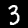{: .inline} should be classified as a 3, while
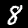{: .inline} as an 8); on a higher --- more akin to reasoning --- level, we
should be able to take the two digits and apply an algorithm (in this case, the addition of two
numbers) to then compute our desired output: the sum.

Although one *could* model the two layers described in a probabilistic logic program (PLP), this is
not the wisest of approaches. The higher level of reasoning used in PLPs, where knowledge is
explicitly declared, does not lend itself well to the higher dimensional correlation search
necessary for classifying images from pixels. At the same time, what is essentially a single line
of code in PLPs for implementing a sum of digits, is a much more complex task to do within the
inner representations of a purely data-driven low-level model based on perception, such as neural
networks.

dPASP exploits this dichotomy between high (reasoning) level *versus* low (perception) level by
merging the two approaches together into a single program. In this section of the tutorial, we
shall look at how we marry neural networks and PLPs in order to leverage the advantages of both
approaches.

#### Neural Rules and Annotated Disjunctions

A dPASP program may contain Python code in between the tags `#!pasp #python` and `#!pasp #end.` to
be used within special sections of the program. The semantics of this will be clear as we go.

```pasp
#python
def my_network(): ...
def digit_network(): ...
def mnist_test(): ...
def mnist_train(): ...
#end.
```

Functions declared this way can then be called outside these guards by adding the prefix
`#!pasp @my_function`, optionally passing arguments like so
`#!pasp @my_function(42, "my_argument")`.

A *neural predicate* is a predicate representing one of the output classes of a neural network. A
*neural rule* is a probabilistic rule whose probability is given by the output of a neural network.
For instance, to write a neural rule that takes some data input `#!pasp X` and embeds a neural
network `#!pasp @my_network`, we may write

```pasp
?::my_pred(X) as @my_network :- input(X).
```

in dPASP, where `my_pred(X)` is the neural predicate before grounding. Just like in probabilistic
rules, the neural predicate will ground with respect to the body; that is, if `#!pasp input(y)` is
true, then `#!pasp my_pred(y)` must also be true (we have chosen the name `#!pasp input(X)` in this
example, but it can be any valid predicate name). The keyword `#!pasp as` associates the output of
the function call `#!pasp @my_network` to the neural predicate, meaning each grounding of `#!pasp
my_pred(X)` will be true according to the output of network `#!pasp @my_network`. The question mark
preceding the neural rule indicates it is learnable; to fix the parameters of the neural network
during learning, replace the `#!pasp ?` with a `#!pasp !`, which indicates the network is "frozen".

Every neural construct must contain in its body a special data predicate to indicate the data to be
fed to the neural network. In the example above, we named it `#!pasp input`, which we should
declare as follows.

```pasp
input(X) ~ test(@eval_dataset), train(@learn_dataset).
```

The above example declares two datasets returned by functions `#!pasp @eval_dataset` and `#!pasp
@learn_dataset` representing the test and train sets respectively. The train set is used when
learning the parameters of a program, and is optional when we do not wish to learn any parameters.
The test set is fed to the network when `#!pasp #query`ing for probabilities.

<div markdown="1" class="example">
We are given two images of digits (e.g. 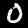{: .inline},
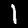{: .inline}, {: .inline}, {: .inline},
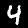{: .inline}, {: .inline}, 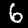{: .inline},
{: .inline}, 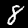{: .inline}, 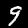{: .inline}),
and wish to find whether the multiplication of the two digits is an even number. We know that
<ol class="roman">
  <li>if any of the two given digits are even, then their product must also be even;</li>
  <li>otherwise, it must be odd.</li>
</ol>
</div>

The example above is modeled by the program below by using the output of a neural network
\(N:\mathcal{X}\to[0,1]\) that maps an image to a probability of whether the number represented by
the image is even. The `#!pasp #query` asks whether the multiplication of the two digits is
`#!pasp even`, which is in turn inferred from rules (i) and (ii) mentioned above.

```pasp
#python
import torch
import torchvision

# The network that maps an image of a digit to a probability of whether it is even.
def even_net(): return torch.nn.Sequential(
    torch.nn.Flatten(),
    torch.nn.Linear(28*28, 128),
    torch.nn.ReLU(True),
    torch.nn.Linear(128, 32),
    torch.nn.ReLU(True),
    torch.nn.Linear(32, 1),
    torch.nn.Sigmoid(),
  )

# Retrieve the MNIST data.
def mnist_data():
  train = torchvision.datasets.MNIST(root = "/tmp", train = True, download = True)
  test  = torchvision.datasets.MNIST(root = "/tmp", train = False, download = True)
  return train.data.float().reshape(len(train), 1, 28, 28)/255., train.targets, \
         test.data.float().reshape(len(test), 1, 28, 28)/255., test.targets

# Normalization function to center pixel values around mu with standard deviation sigma.
def normalize(X_R, Y_R, X_T, Y_T, mu, sigma):
  return (X_R-mu)/sigma, Y_R, (X_T-mu)/sigma, Y_T

train_X, train_Y, test_X, test_Y = normalize(*mnist_data(), 0.1307, 0.3081)
# Whether to pick the first or second half of the dataset.
def pick_slice(data, which):
  h = len(data)//2
  return slice(h, len(data)) if which else slice(0, h)
# MNIST images for the train set.
def mnist_images_train(which): return train_X[pick_slice(train_X, which)]
# MNIST images for the test set.
def mnist_images_test(which): return test_X[pick_slice(test_X, which)]
# Observed atoms for training.
def mnist_labels_train():
  # We join the two halves (top and bottom) of MNIST and join them together to get
  # two digits side by side. The labels are "even" if any one of the digits is even,
  # odd otherwise.
  labels = torch.concatenate((train_Y[:(h := len(train_Y)//2)].reshape(-1, 1),
                              train_Y[h:].reshape(-1, 1)), axis=1)
  return [["even" if x % 2 == 0 or y % 2 == 0 else "odd"] for x, y in labels]
#end.

% Data of the first digit.
input(0) ~ test(@mnist_images_test(0)), train(@mnist_images_train(0)).
% Data of the second digit.
input(1) ~ test(@mnist_images_test(1)), train(@mnist_images_train(1)).

% Neural rule describing whether image X is even.
?::is_even(X) as @even_net :- input(X).
% (i): the multiplication of two digits is even if any of the two digits is even.
even :- is_even(0).
even :- is_even(1).
% (ii): it is odd otherwise.
odd  :- not even.

% Learn the parameters of the program from "even" and "odd" labels.
#learn @mnist_labels_train, lr = 0.0001, niters = 5, alg = "lagrange", batch = 1000.
% Ask for the probability of the product being even.
#query even.
% Choose the maximum entropy semantics.
#semantics maxent.
```

The use of `#!pasp #learn` with a Python function as the data argument is identical to CSV files.
The output of the program is an array containing the probabilities of `#!pasp even` when the
network is fed the test sets given by `#!pasp @mnist_images_test(0)` and
`#!pasp @mnist_images_test(1)`. By using the dPASP Python API to capture the resulting
probabilities, we may then compare against the ground truth.

```python
import pasp
import torchvision
import numpy as np

def mnist_labels():
  "Return the first and second digit values of the test set."
  Y = torchvision.datasets.MNIST(root="/tmp", train=False, download=True).targets
  return Y[:(h := len(Y)//2)].data.numpy(), Y[h:].data.numpy()

P = pasp.parse(...)                 # Parse the multiplication parity program.
R = P(quiet=True)                   # Run program and capture output (suppress prints).
Y = (R > 0.5).reshape(len(R))       # Retrieve what's likeliest (even or odd).
D = mnist_labels()                  # D contains the digits of the test set.
T = (D[0] * D[1]) % 2 == 0          # The ground-truth in the test set.
accuracy = np.sum(Y == T)/len(T)    # Multiplication parity accuracy.
print(f"Accuracy: {100*accuracy}%")
```
```pasp
Learning [==============================================] ETA: 0h00m03s | LL=-0.12404
Querying:                                                      0h00m01s
Accuracy: 94.56%
```

So far, we have only discussed *binary* neural rules, that is, the neural construct is restricted
to only true or false values. A *neural annotated disjunction* is an annotated disjunction whose
atoms are the classes of the network and probabilities are its outputs. In short, neural annotated
disjunctions extend neural rules to categorical distributions.

```pasp
?::digit(X, {0..9}) as @digit_net :- mnist(X).
```

The second argument to `#!pasp digit` specifies all possible classes the network may take. The
interval `#!pasp {0..9}` expands to `#!pasp {0,1,2,3,4,5,6,7,8,9}`, and the neural predicates
resulting from the neural annotated disjunction are `#!pasp digit(X, 0)`, ... ,
`#!pasp digit(X, 9)`. Each of these neural predicates is given a probability according to the
output of network `#!pasp @digit_net`.

<div markdown="1" class="example">
Let us consider a more interesting variation of the previous example. Just like before, we are
given two images of digits (e.g. {: .inline},
{: .inline}, 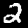{: .inline}, {: .inline},
{: .inline}, 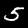{: .inline}, {: .inline},
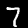{: .inline}, 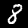{: .inline}, 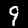{: .inline}).
However, we now wish to find the *sum* of these two digits, i.e. if we are given images
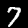{: .inline} and 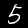{: .inline}, then we wish to infer that
{: .inline} \(+\){: .inline} \(= 12\).
</div>

The program below implements a solution to the example above. We reuse most of the functions of the
previous program but define a more powerful network to classify digits.

```pasp
#python
import torch
import torchvision

# Digit classification network definition.
class Net(torch.nn.Module):
  def __init__(self):
    super().__init__()
    self.encoder = torch.nn.Sequential(
      torch.nn.Conv2d(1, 6, 5),
      torch.nn.MaxPool2d(2, 2),
      torch.nn.ReLU(True),
      torch.nn.Conv2d(6, 16, 5),
      torch.nn.MaxPool2d(2, 2),
      torch.nn.ReLU(True)
    )
    self.classifier = torch.nn.Sequential(
      torch.nn.Linear(16 * 4 * 4, 120),
      torch.nn.ReLU(),
      torch.nn.Linear(120, 84),
      torch.nn.ReLU(),
      torch.nn.Linear(84, 10),
      torch.nn.Softmax(1)
    )

  def forward(self, x):
    x = self.encoder(x)
    x = x.view(-1, 16 * 4 * 4)
    x = self.classifier(x)
    return x

# Return an instance of Net.
def digit_net(): return Net()

# Retrieve the MNIST data.
def mnist_data():
  train = torchvision.datasets.MNIST(root = "/tmp", train = True, download = True)
  test  = torchvision.datasets.MNIST(root = "/tmp", train = False, download = True)
  return train.data.float().reshape(len(train), 1, 28, 28)/255., train.targets, \
         test.data.float().reshape(len(test), 1, 28, 28)/255., test.targets

# Normalization function to center pixel values around mu with standard deviation sigma.
def normalize(X_R, Y_R, X_T, Y_T, mu, sigma):
  return (X_R-mu)/sigma, Y_R, (X_T-mu)/sigma, Y_T

train_X, train_Y, test_X, test_Y = normalize(*mnist_data(), 0.1307, 0.3081)
# Whether to pick the first or second half of the dataset.
def pick_slice(data, which):
  h = len(data)//2
  return slice(h, len(data)) if which else slice(0, h)
# MNIST images for the train set.
def mnist_images_train(which): return train_X[pick_slice(train_X, which)]
# MNIST images for the test set.
def mnist_images_test(which): return test_X[pick_slice(test_X, which)]
# Observed atoms for training.
def mnist_labels_train():
  # We join the two halves (top and bottom) of MNIST and join them together to get
  # two digits side by side. The labels are atoms encoding the sum of the two digits.
  labels = torch.concatenate((train_Y[:(h := len(train_Y)//2)].reshape(-1, 1),
                              train_Y[h:].reshape(-1, 1)), axis=1)
  return [[f"sum({x.item() + y.item()})"] for x, y in labels]
#end.

% Data of the first digit.
input(0) ~ test(@mnist_images_test(0)), train(@mnist_images_train(0)).
% Data of the second digit.
input(1) ~ test(@mnist_images_test(1)), train(@mnist_images_train(1)).

% Neural annotated disjunction over each digit from 0 to 9; use Adam as optimizer
% and a learning rate of 0.001.
?::digit(X, {0..9}) as @digit_net with optim = "Adam", lr = 0.001 :- input(X).
% The sum.
sum(Z) :- digit(0, X), digit(1, Y), Z = X+Y.

% Learn the parameters of the program from the "sum(X)" atoms.
#learn @mnist_labels_train, lr = 1., niters = 5, alg = "lagrange", batch = 500.
#semantics maxent.
% Ask for the probability of all groundings of sum(X).
#query sum(X).
```

The first thing to note is the use of the `#!pasp with` keyword. Within neural construct
declarations, the use of `#!pasp with` offers a way to set different learning parameters to each
embedded neural network. Here in our example, the neural network embedded onto the neural annotated
disjunction `#!pasp digit(X, {0..9})` is set to use the
[Adam optimizer](https://pytorch.org/docs/stable/generated/torch.optim.Adam.html) with a learning
rate of 0.001. Internally, dPASP multiplies the learning rate of the program (i.e. the `#!pasp lr`
argument in `#!pasp #learn`) with the learning rate of the neural construct. Let's use the Python
API to check how well our program performs.

```python
import pasp
import torchvision
import numpy as np

def mnist_labels():
  "Return the first and second digit values of the test set."
  Y = torchvision.datasets.MNIST(root="/tmp", train=False, download=True).targets
  return Y[:(h := len(Y)//2)].data.numpy(), Y[h:].data.numpy()

P = pasp.parse(...)                      # Parse the sum of digits program.
R = P(quiet=True)                        # Run program and capture output.
Y = np.argmax(R, axis=1).reshape(len(R)) # Retrieve what sum is likeliest.
D = mnist_labels()                       # D contains the digits of the test set.
T = D[0] + D[1]                          # The ground-truth in the test set.
accuracy = np.sum(Y == T)/len(T)         # Digit sum accuracy.
print(f"Accuracy: {100*accuracy}%")
```
```pasp
Learning [==============================================] ETA: 0h00m17s | LL=-0.24386
Querying:                                                      0h00m31s
Accuracy: 92.22%
```

That's a fairly good accuracy!

#### Relational Learning with Neural Predicates

WIP

### References
